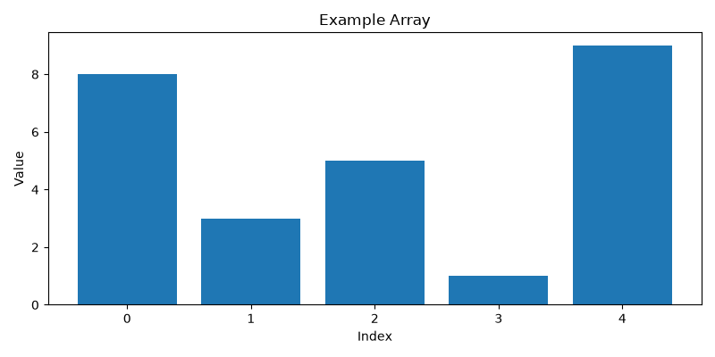
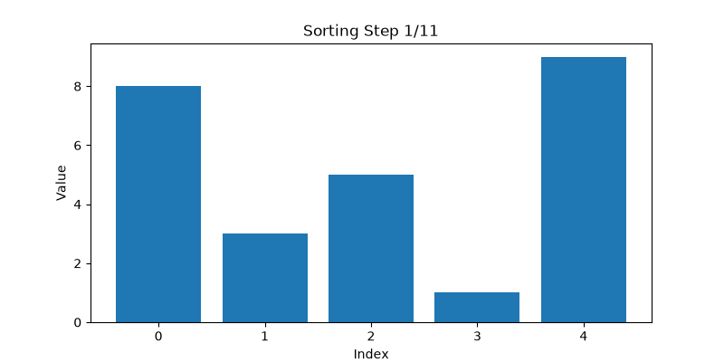
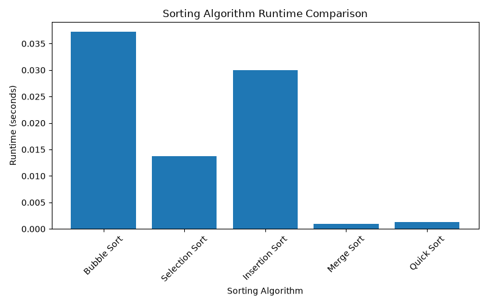

# Algorithms Visualizer

A Python-based algorithms visualization project that implements, tests, benchmarks, and visualizes classic sorting algorithms.

This project demonstrates core computer science concepts including algorithm design, data structures, Big-O complexity analysis, performance benchmarking, data visualization, and automated testing.

The goal of this project is to explore how different sorting algorithms behave both theoretically and practically by comparing their implementation, execution time, and performance characteristics.

---

# Motivation

Understanding algorithms requires more than knowing how to write code. It requires understanding:

- How algorithms solve problems
- How data structures support computation
- How efficiency changes with input size
- How theoretical complexity relates to real-world performance

This project was created to strengthen my computer science foundation by implementing common sorting algorithms from scratch and analyzing their behavior.

---

# Features

This project includes:

- Implementation of five sorting algorithms
- Step-by-step sorting visualization
- Animated sorting demonstrations
- Algorithm performance benchmarking
- Runtime comparison visualization
- CSV export of benchmark results
- Automated testing with pytest
- Modular Python project structure

---

# Implemented Algorithms

The following sorting algorithms are implemented:

## Bubble Sort

A simple comparison-based sorting algorithm that repeatedly swaps adjacent elements when they are in the incorrect order.

## Selection Sort

Finds the smallest remaining element and places it into its correct position.

## Insertion Sort

Builds the sorted list one element at a time by inserting each value into its correct position.

## Merge Sort

A divide-and-conquer algorithm that recursively splits the list and merges sorted sublists.

## Quick Sort

A divide-and-conquer algorithm that partitions elements around a pivot and recursively sorts the partitions.

---

# Algorithm Complexity Analysis

The implemented sorting algorithms were analyzed using Big-O notation.

| Algorithm | Best Case | Average Case | Worst Case | Space Complexity |
|---|---|---|---|---|
| Bubble Sort | O(n) | O(n²) | O(n²) | O(1) |
| Selection Sort | O(n²) | O(n²) | O(n²) | O(1) |
| Insertion Sort | O(n) | O(n²) | O(n²) | O(1) |
| Merge Sort | O(n log n) | O(n log n) | O(n log n) | O(n) |
| Quick Sort | O(n log n) | O(n log n) | O(n²) | O(log n) |

The benchmark results demonstrate the practical performance differences between quadratic-time sorting algorithms and more efficient divide-and-conquer approaches.

---

# Visualization

The project generates visual representations of algorithm behavior.

## Sorting Example



## Bubble Sort Animation



---

# Benchmarking

Sorting algorithms were tested using a reverse-ordered dataset containing 1,000 numbers.

Each algorithm was measured based on execution time.

Benchmark results are saved to:

```text
results/benchmark_results.csv
```

Example benchmark output:

| Algorithm | Runtime |
|---|---:|
| Bubble Sort | 0.037 seconds |
| Selection Sort | 0.014 seconds |
| Insertion Sort | 0.030 seconds |
| Merge Sort | 0.001 seconds |
| Quick Sort | 0.001 seconds |

---

# Runtime Comparison

The benchmark results were visualized using matplotlib.



The results demonstrate that Merge Sort and Quick Sort perform significantly better than quadratic-time sorting algorithms as dataset size increases.

---

# Technologies Used

- Python 3
- matplotlib
- pandas
- pytest
- Git
- GitHub

---

# Project Structure

```text
algorithms-visualizer/

├── images/
│   ├── example_array.png
│   ├── bubble_sort_animation.gif
│   └── runtime_comparison.png
│
├── results/
│   └── benchmark_results.csv
│
├── src/
│   ├── algorithms.py
│   ├── animation.py
│   ├── benchmark.py
│   ├── plot_benchmarks.py
│   ├── run_benchmarks.py
│   ├── save_benchmarks.py
│   └── visualize.py
│
├── tests/
│   └── test_algorithms.py
│
├── README.md
├── requirements.txt
└── .gitignore
```

---

# Installation

Clone the repository:

```bash
git clone https://github.com/alexandra-002/algorithms-visualizer.git
```

Navigate into the project:

```bash
cd algorithms-visualizer
```

Install dependencies:

```bash
pip install -r requirements.txt
```

---

# Usage

## Run Sorting Visualization

```bash
py src/main.py
```

## Run Benchmarks

```bash
py src/run_benchmarks.py
```

## Generate Runtime Graph

```bash
py src/plot_benchmarks.py
```

---

# Testing

Run the automated test suite:

```bash
py -m pytest
```

Example output:

```text
================ test session starts ================

collected 15 items

tests/test_algorithms.py ............... [100%]

15 passed
```

Tests verify:

- Sorting correctness
- Handling of duplicate values
- Handling of empty lists
- Algorithm functionality
- Expected output behavior

---

# Future Improvements

Potential improvements include:

- Add searching algorithm visualizations
- Add graph algorithm demonstrations
- Add data structure visualizations
- Add interactive controls for animations
- Compare additional sorting algorithms
- Add larger dataset performance testing

---

# Skills Demonstrated

This project demonstrates:

- Python programming
- Algorithms and data structures
- Sorting algorithm implementation
- Big-O complexity analysis
- Performance benchmarking
- Data visualization
- Automated testing
- Modular software design
- Git version control
- Technical documentation

---

# Author

**Alexandra Sigmon**